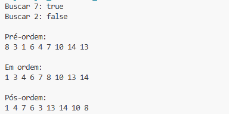

# Perguntas:
## 1º) Pergunta:
Recursividade é quando uma função se chama sozinha para resolver um problema por partes menores.
## 2º) Pergunta:
Ela ajuda pois cada subárvore é tratada do mesmo jeito que a árvore inteira.
### 3º) Pergunta:
Nos laços o código se repete várias vezes, seja com uma quantidade de repetições pré-definida ou enquanto um valor for verdadeiro.
Na recursão, em vez de repetir, a função se chama de novo.

# Evidência de execução

